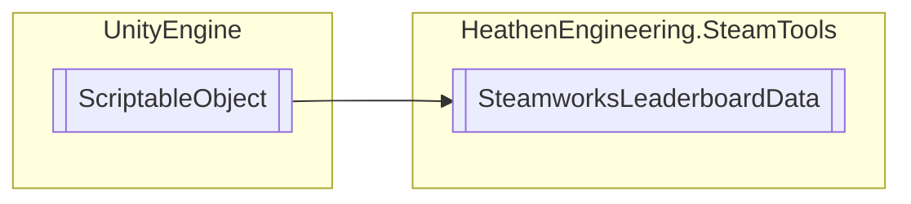

# SteamworksLeaderboardData `Public class`

## Diagram


## Members
### Methods
#### Public  methods
| Returns | Name |
| --- | --- |
| `void` | [`QueryEntries`](#queryentries)(`ELeaderboardDataRequest` requestType, `int` rangeStart, `int` rangeEnd) |
| `void` | [`QueryFriendEntries`](#queryfriendentries)(`int` aroundPlayer) |
| `void` | [`QueryPeerEntries`](#querypeerentries)(`int` aroundPlayer) |
| `void` | [`QueryTopEntries`](#querytopentries)(`int` count) |
| `void` | [`RefreshUserEntry`](#refreshuserentry)() |
| `void` | [`Register`](#register)() |
| `void` | [`UploadScore`](#uploadscore-12)(`...`) |

## Details
### Inheritance
 - `ScriptableObject`

### Constructors
#### SteamworksLeaderboardData
```csharp
public SteamworksLeaderboardData()
```

### Methods
#### Register
```csharp
public void Register()
```

#### RefreshUserEntry
```csharp
public void RefreshUserEntry()
```

#### UploadScore [1/2]
```csharp
public void UploadScore(int score, ELeaderboardUploadScoreMethod method)
```
##### Arguments
| Type | Name | Description |
| --- | --- | --- |
| `int` | score |   |
| `ELeaderboardUploadScoreMethod` | method |   |

#### UploadScore [2/2]
```csharp
public void UploadScore(int score, int[] scoreDetails, ELeaderboardUploadScoreMethod method)
```
##### Arguments
| Type | Name | Description |
| --- | --- | --- |
| `int` | score |   |
| `int``[]` | scoreDetails |   |
| `ELeaderboardUploadScoreMethod` | method |   |

#### QueryTopEntries
```csharp
public void QueryTopEntries(int count)
```
##### Arguments
| Type | Name | Description |
| --- | --- | --- |
| `int` | count |   |

#### QueryFriendEntries
```csharp
public void QueryFriendEntries(int aroundPlayer)
```
##### Arguments
| Type | Name | Description |
| --- | --- | --- |
| `int` | aroundPlayer |   |

#### QueryPeerEntries
```csharp
public void QueryPeerEntries(int aroundPlayer)
```
##### Arguments
| Type | Name | Description |
| --- | --- | --- |
| `int` | aroundPlayer |   |

#### QueryEntries
```csharp
public void QueryEntries(ELeaderboardDataRequest requestType, int rangeStart, int rangeEnd)
```
##### Arguments
| Type | Name | Description |
| --- | --- | --- |
| `ELeaderboardDataRequest` | requestType |   |
| `int` | rangeStart |   |
| `int` | rangeEnd |   |

*Generated with* [*ModularDoc*](https://github.com/hailstorm75/ModularDoc)
