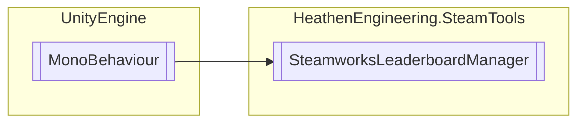

# SteamworksLeaderboardManager `Public class`

## Diagram


## Members
### Methods
#### Public  methods
| Returns | Name |
| --- | --- |
| [`SteamworksLeaderboardData`](./heathenengineeringsteamtools-SteamworksLeaderboardData) | [`GetLeaderboard`](#getleaderboard-12)(`...`) |
| `void` | [`UploadLeaderboardScore`](#uploadleaderboardscore-13)(`...`) |

#### Public Static methods
| Returns | Name |
| --- | --- |
| `void` | [`_UploadLeaderboardScore`](#uploadleaderboardscore-13)(`...`) |

## Details
### Inheritance
 - `MonoBehaviour`

### Constructors
#### SteamworksLeaderboardManager
```csharp
public SteamworksLeaderboardManager()
```

### Methods
#### GetLeaderboard [1/2]
```csharp
public SteamworksLeaderboardData GetLeaderboard(string name)
```
##### Arguments
| Type | Name | Description |
| --- | --- | --- |
| `string` | name |   |

#### GetLeaderboard [2/2]
```csharp
public SteamworksLeaderboardData GetLeaderboard(LeaderboardRankChangeData chageData)
```
##### Arguments
| Type | Name | Description |
| --- | --- | --- |
| [`LeaderboardRankChangeData`](./heathenengineeringsteamtools-LeaderboardRankChangeData) | chageData |   |

#### UploadLeaderboardScore [1/3]
```csharp
public void UploadLeaderboardScore(string boardName, int score, ELeaderboardUploadScoreMethod method)
```
##### Arguments
| Type | Name | Description |
| --- | --- | --- |
| `string` | boardName |   |
| `int` | score |   |
| `ELeaderboardUploadScoreMethod` | method |   |

#### UploadLeaderboardScore [2/3]
```csharp
public void UploadLeaderboardScore(int boardIndex, int score, ELeaderboardUploadScoreMethod method)
```
##### Arguments
| Type | Name | Description |
| --- | --- | --- |
| `int` | boardIndex |   |
| `int` | score |   |
| `ELeaderboardUploadScoreMethod` | method |   |

#### UploadLeaderboardScore [3/3]
```csharp
public void UploadLeaderboardScore(SteamworksLeaderboardData leaderboard, int score, ELeaderboardUploadScoreMethod method)
```
##### Arguments
| Type | Name | Description |
| --- | --- | --- |
| [`SteamworksLeaderboardData`](./heathenengineeringsteamtools-SteamworksLeaderboardData) | leaderboard |   |
| `int` | score |   |
| `ELeaderboardUploadScoreMethod` | method |   |

#### _UploadLeaderboardScore [1/3]
```csharp
public static void _UploadLeaderboardScore(string boardName, int score, ELeaderboardUploadScoreMethod method)
```
##### Arguments
| Type | Name | Description |
| --- | --- | --- |
| `string` | boardName |   |
| `int` | score |   |
| `ELeaderboardUploadScoreMethod` | method |   |

#### _UploadLeaderboardScore [2/3]
```csharp
public static void _UploadLeaderboardScore(int boardIndex, int score, ELeaderboardUploadScoreMethod method)
```
##### Arguments
| Type | Name | Description |
| --- | --- | --- |
| `int` | boardIndex |   |
| `int` | score |   |
| `ELeaderboardUploadScoreMethod` | method |   |

#### _UploadLeaderboardScore [3/3]
```csharp
public static void _UploadLeaderboardScore(SteamworksLeaderboardData leaderboard, int score, ELeaderboardUploadScoreMethod method)
```
##### Arguments
| Type | Name | Description |
| --- | --- | --- |
| [`SteamworksLeaderboardData`](./heathenengineeringsteamtools-SteamworksLeaderboardData) | leaderboard |   |
| `int` | score |   |
| `ELeaderboardUploadScoreMethod` | method |   |

*Generated with* [*ModularDoc*](https://github.com/hailstorm75/ModularDoc)
