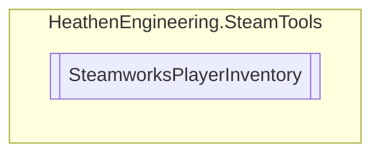

# SteamworksPlayerInventory `Public class`

## Diagram


## Members
### Methods
#### Public Static methods
| Returns | Name |
| --- | --- |
| `bool` | [`AddPromoItem`](#addpromoitem)(`SteamItemDef_t` itemDefinition, `Action`&lt;`bool`, `SteamItemDetails_t``[]`&gt; callback) |
| `bool` | [`AddPromoItems`](#addpromoitems)(`IEnumerable`&lt;`SteamItemDef_t`&gt; itemDefinitions, `Action`&lt;`bool`, `SteamItemDetails_t``[]`&gt; callback) |
| `bool` | [`CheckResultSteamID`](#checkresultsteamid-13)(`...`) |
| `bool` | [`ConsumeItem`](#consumeitem-12)(`...`) |
| `bool` | [`DeserializeResult`](#deserializeresult-13)(`...`) |
| `bool` | [`DeveloperOnlyGenerateItems`](#developeronlygenerateitems)(`List`&lt;[`GenerateItemCount`](./heathenengineeringsteamtools-GenerateItemCount)&gt; ItemDefinitions, `Action`&lt;`bool`, `SteamItemDetails_t``[]`&gt; callback) |
| `bool` | [`ExchangeItems`](#exchangeitems-12)(`...`) |
| `bool` | [`GetAllItems`](#getallitems)(`Action`&lt;`bool`, `SteamItemDetails_t``[]`&gt; callback) |
| `bool` | [`GetItemsByID`](#getitemsbyid)(`IEnumerable`&lt;`SteamItemInstanceID_t`&gt; InstanceIDs, `Action`&lt;`bool`, `SteamItemDetails_t``[]`&gt; callback) |
| `bool` | [`GrantPromoItems`](#grantpromoitems)(`Action`&lt;`bool`, `SteamItemDetails_t``[]`&gt; callback) |
| `bool` | [`RegisterCallbacks`](#registercallbacks)() |
| `bool` | [`RequestEligiblePromoItemDefinitionsIDs`](#requesteligiblepromoitemdefinitionsids)(`CSteamID` steamID, `Action`&lt;`bool`, `SteamItemDef_t``[]`&gt; callback) |
| `bool` | [`SerializeResults`](#serializeresults)(`IEnumerable`&lt;`SteamItemInstanceID_t`&gt; InstanceIDs, `Action`&lt;`bool`, `byte``[]`&gt; callback) |
| `bool` | [`SplitItems`](#splititems)(`SteamItemInstanceID_t` sourceItem, `uint` quantityToMove, `Action`&lt;`bool`&gt; callback) |
| `bool` | [`TransferQuantity`](#transferquantity)(`SteamItemInstanceID_t` sourceItem, `uint` quantityToMove, `SteamItemInstanceID_t` destinationItem, `Action`&lt;`bool`&gt; callback) |
| `bool` | [`TriggerItemDrop`](#triggeritemdrop)(`SteamItemDef_t` dropListDefinition, `Action`&lt;`bool`, `SteamItemDetails_t``[]`&gt; callback) |

## Details
### Methods
#### RegisterCallbacks
```csharp
public static bool RegisterCallbacks()
```

#### GetAllItems
```csharp
public static bool GetAllItems(Action<bool, SteamItemDetails_t[]> callback)
```
##### Arguments
| Type | Name | Description |
| --- | --- | --- |
| `Action`&lt;`bool`, `SteamItemDetails_t``[]`&gt; | callback |   |

#### AddPromoItem
```csharp
public static bool AddPromoItem(SteamItemDef_t itemDefinition, Action<bool, SteamItemDetails_t[]> callback)
```
##### Arguments
| Type | Name | Description |
| --- | --- | --- |
| `SteamItemDef_t` | itemDefinition |   |
| `Action`&lt;`bool`, `SteamItemDetails_t``[]`&gt; | callback |   |

#### AddPromoItems
```csharp
public static bool AddPromoItems(IEnumerable<SteamItemDef_t> itemDefinitions, Action<bool, SteamItemDetails_t[]> callback)
```
##### Arguments
| Type | Name | Description |
| --- | --- | --- |
| `IEnumerable`&lt;`SteamItemDef_t`&gt; | itemDefinitions |   |
| `Action`&lt;`bool`, `SteamItemDetails_t``[]`&gt; | callback |   |

#### CheckResultSteamID [1/3]
```csharp
public static bool CheckResultSteamID(SteamInventoryResult_t resultHandle, CSteamID steamIDExpected)
```
##### Arguments
| Type | Name | Description |
| --- | --- | --- |
| `SteamInventoryResult_t` | resultHandle |   |
| `CSteamID` | steamIDExpected |   |

#### CheckResultSteamID [2/3]
```csharp
public static bool CheckResultSteamID(SteamInventoryResult_t resultHandle, SteamUserData steamUserExpected)
```
##### Arguments
| Type | Name | Description |
| --- | --- | --- |
| `SteamInventoryResult_t` | resultHandle |   |
| [`SteamUserData`](./heathenengineeringsteamtools-SteamUserData) | steamUserExpected |   |

#### CheckResultSteamID [3/3]
```csharp
public static bool CheckResultSteamID(SteamInventoryResult_t resultHandle, ulong steamIDExpected)
```
##### Arguments
| Type | Name | Description |
| --- | --- | --- |
| `SteamInventoryResult_t` | resultHandle |   |
| `ulong` | steamIDExpected |   |

#### ConsumeItem [1/2]
```csharp
public static bool ConsumeItem(SteamItemInstanceID_t instanceId, Action<bool, SteamItemDetails_t[]> callback)
```
##### Arguments
| Type | Name | Description |
| --- | --- | --- |
| `SteamItemInstanceID_t` | instanceId |   |
| `Action`&lt;`bool`, `SteamItemDetails_t``[]`&gt; | callback |   |

#### ConsumeItem [2/2]
```csharp
public static bool ConsumeItem(SteamItemInstanceID_t instanceId, uint quantity, Action<bool, SteamItemDetails_t[]> callback)
```
##### Arguments
| Type | Name | Description |
| --- | --- | --- |
| `SteamItemInstanceID_t` | instanceId |   |
| `uint` | quantity |   |
| `Action`&lt;`bool`, `SteamItemDetails_t``[]`&gt; | callback |   |

#### DeserializeResult [1/3]
```csharp
public static bool DeserializeResult(byte[] buffer, CSteamID fromUser, Action<bool, SteamItemDetails_t[]> callback)
```
##### Arguments
| Type | Name | Description |
| --- | --- | --- |
| `byte``[]` | buffer |   |
| `CSteamID` | fromUser |   |
| `Action`&lt;`bool`, `SteamItemDetails_t``[]`&gt; | callback |   |

#### DeserializeResult [2/3]
```csharp
public static bool DeserializeResult(byte[] buffer, SteamUserData fromUser, Action<bool, SteamItemDetails_t[]> callback)
```
##### Arguments
| Type | Name | Description |
| --- | --- | --- |
| `byte``[]` | buffer |   |
| [`SteamUserData`](./heathenengineeringsteamtools-SteamUserData) | fromUser |   |
| `Action`&lt;`bool`, `SteamItemDetails_t``[]`&gt; | callback |   |

#### DeserializeResult [3/3]
```csharp
public static bool DeserializeResult(byte[] buffer, ulong fromUser, Action<bool, SteamItemDetails_t[]> callback)
```
##### Arguments
| Type | Name | Description |
| --- | --- | --- |
| `byte``[]` | buffer |   |
| `ulong` | fromUser |   |
| `Action`&lt;`bool`, `SteamItemDetails_t``[]`&gt; | callback |   |

#### ExchangeItems [1/2]
```csharp
public static bool ExchangeItems(ItemExchangeRecipe recipe, Action<bool, SteamItemDetails_t[]> callback)
```
##### Arguments
| Type | Name | Description |
| --- | --- | --- |
| [`ItemExchangeRecipe`](./heathenengineeringsteamtools-ItemExchangeRecipe) | recipe |   |
| `Action`&lt;`bool`, `SteamItemDetails_t``[]`&gt; | callback |   |

#### ExchangeItems [2/2]
```csharp
public static bool ExchangeItems(SteamItemDef_t toGenerate, IEnumerable<ExchangeItemCount> toBeConsumed, Action<bool, SteamItemDetails_t[]> callback)
```
##### Arguments
| Type | Name | Description |
| --- | --- | --- |
| `SteamItemDef_t` | toGenerate |   |
| `IEnumerable`&lt;[`ExchangeItemCount`](./heathenengineeringsteamtools-ExchangeItemCount)&gt; | toBeConsumed |   |
| `Action`&lt;`bool`, `SteamItemDetails_t``[]`&gt; | callback |   |

#### DeveloperOnlyGenerateItems
```csharp
public static bool DeveloperOnlyGenerateItems(List<GenerateItemCount> ItemDefinitions, Action<bool, SteamItemDetails_t[]> callback)
```
##### Arguments
| Type | Name | Description |
| --- | --- | --- |
| `List`&lt;[`GenerateItemCount`](./heathenengineeringsteamtools-GenerateItemCount)&gt; | ItemDefinitions |   |
| `Action`&lt;`bool`, `SteamItemDetails_t``[]`&gt; | callback |   |

#### GetItemsByID
```csharp
public static bool GetItemsByID(IEnumerable<SteamItemInstanceID_t> InstanceIDs, Action<bool, SteamItemDetails_t[]> callback)
```
##### Arguments
| Type | Name | Description |
| --- | --- | --- |
| `IEnumerable`&lt;`SteamItemInstanceID_t`&gt; | InstanceIDs |   |
| `Action`&lt;`bool`, `SteamItemDetails_t``[]`&gt; | callback |   |

#### GrantPromoItems
```csharp
public static bool GrantPromoItems(Action<bool, SteamItemDetails_t[]> callback)
```
##### Arguments
| Type | Name | Description |
| --- | --- | --- |
| `Action`&lt;`bool`, `SteamItemDetails_t``[]`&gt; | callback |   |

#### RequestEligiblePromoItemDefinitionsIDs
```csharp
public static bool RequestEligiblePromoItemDefinitionsIDs(CSteamID steamID, Action<bool, SteamItemDef_t[]> callback)
```
##### Arguments
| Type | Name | Description |
| --- | --- | --- |
| `CSteamID` | steamID |   |
| `Action`&lt;`bool`, `SteamItemDef_t``[]`&gt; | callback |   |

#### SerializeResults
```csharp
public static bool SerializeResults(IEnumerable<SteamItemInstanceID_t> InstanceIDs, Action<bool, byte[]> callback)
```
##### Arguments
| Type | Name | Description |
| --- | --- | --- |
| `IEnumerable`&lt;`SteamItemInstanceID_t`&gt; | InstanceIDs |   |
| `Action`&lt;`bool`, `byte``[]`&gt; | callback |   |

#### TransferQuantity
```csharp
public static bool TransferQuantity(SteamItemInstanceID_t sourceItem, uint quantityToMove, SteamItemInstanceID_t destinationItem, Action<bool> callback)
```
##### Arguments
| Type | Name | Description |
| --- | --- | --- |
| `SteamItemInstanceID_t` | sourceItem |   |
| `uint` | quantityToMove |   |
| `SteamItemInstanceID_t` | destinationItem |   |
| `Action`&lt;`bool`&gt; | callback |   |

#### SplitItems
```csharp
public static bool SplitItems(SteamItemInstanceID_t sourceItem, uint quantityToMove, Action<bool> callback)
```
##### Arguments
| Type | Name | Description |
| --- | --- | --- |
| `SteamItemInstanceID_t` | sourceItem |   |
| `uint` | quantityToMove |   |
| `Action`&lt;`bool`&gt; | callback |   |

#### TriggerItemDrop
```csharp
public static bool TriggerItemDrop(SteamItemDef_t dropListDefinition, Action<bool, SteamItemDetails_t[]> callback)
```
##### Arguments
| Type | Name | Description |
| --- | --- | --- |
| `SteamItemDef_t` | dropListDefinition |   |
| `Action`&lt;`bool`, `SteamItemDetails_t``[]`&gt; | callback |   |

*Generated with* [*ModularDoc*](https://github.com/hailstorm75/ModularDoc)
