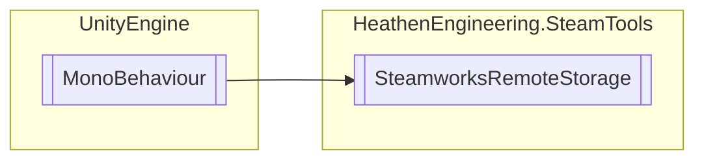

# SteamworksRemoteStorage `Public class`

## Diagram


## Members
### Properties
#### Public Static properties
| Type | Name | Methods |
| --- | --- | --- |
| [`SteamworksRemoteStorage`](heathenengineeringsteamtools-SteamworksRemoteStorage) | [`Instance`](#instance) | `get` |

#### Public  properties
| Type | Name | Methods |
| --- | --- | --- |
| `bool` | [`IsCloudEnabledForAccount`](#iscloudenabledforaccount) | `get` |
| `bool` | [`IsCloudEnabledForApp`](#iscloudenabledforapp) | `get` |

### Methods
#### Public  methods
| Returns | Name |
| --- | --- |
| `bool` | [`FileDelete`](#filedelete-12)(`...`) |
| `bool` | [`FileExists`](#fileexists-12)(`...`) |
| `bool` | [`FileForget`](#fileforget-12)(`...`) |
| [`SteamDataFile`](./heathenengineeringsteamtools-SteamDataFile) | [`FileRead`](#fileread-12)(`...`) |
| [`SteamDataFile`](./heathenengineeringsteamtools-SteamDataFile) | [`FileReadAsync`](#filereadasync-12)(`...`) |
| `byte``[]` | [`FileReadData`](#filereaddata)(`string` fileName) |
| `bool` | [`FileWrite`](#filewrite-13)(`...`) |
| `bool` | [`FileWriteAsync`](#filewriteasync-13)(`...`) |
| `bool` | [`FileWriteData`](#filewritedata)(`string` fileName, `byte``[]` data) |
| [`SteamDataLibrary`](./heathenengineeringsteamtools-SteamDataLibrary) | [`GetDataModelLibrary`](#getdatamodellibrary-13)(`...`) |
| `DateTime` | [`GetFileTimestamp`](#getfiletimestamp-12)(`...`) |
| `void` | [`RefreshDataFilesIndex`](#refreshdatafilesindex)() |
| `void` | [`SetCloudEnabledForApp`](#setcloudenabledforapp)(`bool` enable) |
| `bool` | [`SetSyncPlatforms`](#setsyncplatforms-13)(`...`) |

## Details
### Inheritance
 - `MonoBehaviour`

### Constructors
#### SteamworksRemoteStorage
```csharp
public SteamworksRemoteStorage()
```

### Methods
#### RefreshDataFilesIndex
```csharp
public void RefreshDataFilesIndex()
```

#### GetDataModelLibrary [1/3]
```csharp
public SteamDataLibrary GetDataModelLibrary(string fileName)
```
##### Arguments
| Type | Name | Description |
| --- | --- | --- |
| `string` | fileName |   |

#### GetDataModelLibrary [2/3]
```csharp
public SteamDataLibrary GetDataModelLibrary(SteamDataFileAddress address)
```
##### Arguments
| Type | Name | Description |
| --- | --- | --- |
| [`SteamDataFileAddress`](./heathenengineeringsteamtools-SteamDataFileAddress) | address |   |

#### GetDataModelLibrary [3/3]
```csharp
public SteamDataLibrary GetDataModelLibrary(SteamDataFile file)
```
##### Arguments
| Type | Name | Description |
| --- | --- | --- |
| [`SteamDataFile`](./heathenengineeringsteamtools-SteamDataFile) | file |   |

#### SetCloudEnabledForApp
```csharp
public void SetCloudEnabledForApp(bool enable)
```
##### Arguments
| Type | Name | Description |
| --- | --- | --- |
| `bool` | enable |   |

#### SetSyncPlatforms [1/3]
```csharp
public bool SetSyncPlatforms(SteamDataFile file, ERemoteStoragePlatform platform)
```
##### Arguments
| Type | Name | Description |
| --- | --- | --- |
| [`SteamDataFile`](./heathenengineeringsteamtools-SteamDataFile) | file |   |
| `ERemoteStoragePlatform` | platform |   |

#### SetSyncPlatforms [2/3]
```csharp
public bool SetSyncPlatforms(SteamDataFileAddress address, ERemoteStoragePlatform platform)
```
##### Arguments
| Type | Name | Description |
| --- | --- | --- |
| [`SteamDataFileAddress`](./heathenengineeringsteamtools-SteamDataFileAddress) | address |   |
| `ERemoteStoragePlatform` | platform |   |

#### SetSyncPlatforms [3/3]
```csharp
public bool SetSyncPlatforms(string fileName, ERemoteStoragePlatform platform)
```
##### Arguments
| Type | Name | Description |
| --- | --- | --- |
| `string` | fileName |   |
| `ERemoteStoragePlatform` | platform |   |

#### GetFileTimestamp [1/2]
```csharp
public DateTime GetFileTimestamp(string fileName)
```
##### Arguments
| Type | Name | Description |
| --- | --- | --- |
| `string` | fileName |   |

#### GetFileTimestamp [2/2]
```csharp
public DateTime GetFileTimestamp(SteamDataFileAddress address)
```
##### Arguments
| Type | Name | Description |
| --- | --- | --- |
| [`SteamDataFileAddress`](./heathenengineeringsteamtools-SteamDataFileAddress) | address |   |

#### FileDelete [1/2]
```csharp
public bool FileDelete(string fileName)
```
##### Arguments
| Type | Name | Description |
| --- | --- | --- |
| `string` | fileName |   |

#### FileDelete [2/2]
```csharp
public bool FileDelete(SteamDataFileAddress address)
```
##### Arguments
| Type | Name | Description |
| --- | --- | --- |
| [`SteamDataFileAddress`](./heathenengineeringsteamtools-SteamDataFileAddress) | address |   |

#### FileExists [1/2]
```csharp
public bool FileExists(string fileName)
```
##### Arguments
| Type | Name | Description |
| --- | --- | --- |
| `string` | fileName |   |

#### FileExists [2/2]
```csharp
public bool FileExists(SteamDataFileAddress address)
```
##### Arguments
| Type | Name | Description |
| --- | --- | --- |
| [`SteamDataFileAddress`](./heathenengineeringsteamtools-SteamDataFileAddress) | address |   |

#### FileRead [1/2]
```csharp
public SteamDataFile FileRead(string fileName)
```
##### Arguments
| Type | Name | Description |
| --- | --- | --- |
| `string` | fileName |   |

#### FileReadData
```csharp
public byte FileReadData(string fileName)
```
##### Arguments
| Type | Name | Description |
| --- | --- | --- |
| `string` | fileName |   |

#### FileRead [2/2]
```csharp
public SteamDataFile FileRead(SteamDataFileAddress address)
```
##### Arguments
| Type | Name | Description |
| --- | --- | --- |
| [`SteamDataFileAddress`](./heathenengineeringsteamtools-SteamDataFileAddress) | address |   |

#### FileReadAsync [1/2]
```csharp
public SteamDataFile FileReadAsync(string fileName)
```
##### Arguments
| Type | Name | Description |
| --- | --- | --- |
| `string` | fileName |   |

#### FileReadAsync [2/2]
```csharp
public SteamDataFile FileReadAsync(SteamDataFileAddress address)
```
##### Arguments
| Type | Name | Description |
| --- | --- | --- |
| [`SteamDataFileAddress`](./heathenengineeringsteamtools-SteamDataFileAddress) | address |   |

#### FileForget [1/2]
```csharp
public bool FileForget(string fileName)
```
##### Arguments
| Type | Name | Description |
| --- | --- | --- |
| `string` | fileName |   |

#### FileForget [2/2]
```csharp
public bool FileForget(SteamDataFileAddress address)
```
##### Arguments
| Type | Name | Description |
| --- | --- | --- |
| [`SteamDataFileAddress`](./heathenengineeringsteamtools-SteamDataFileAddress) | address |   |

#### FileWrite [1/3]
```csharp
public bool FileWrite(SteamDataFile file)
```
##### Arguments
| Type | Name | Description |
| --- | --- | --- |
| [`SteamDataFile`](./heathenengineeringsteamtools-SteamDataFile) | file |   |

#### FileWrite [2/3]
```csharp
public bool FileWrite(string fileName, byte[] data)
```
##### Arguments
| Type | Name | Description |
| --- | --- | --- |
| `string` | fileName |   |
| `byte``[]` | data |   |

#### FileWriteData
```csharp
public bool FileWriteData(string fileName, byte[] data)
```
##### Arguments
| Type | Name | Description |
| --- | --- | --- |
| `string` | fileName |   |
| `byte``[]` | data |   |

#### FileWrite [3/3]
```csharp
public bool FileWrite(string fileName, SteamDataLibrary lib)
```
##### Arguments
| Type | Name | Description |
| --- | --- | --- |
| `string` | fileName |   |
| [`SteamDataLibrary`](./heathenengineeringsteamtools-SteamDataLibrary) | lib |   |

#### FileWriteAsync [1/3]
```csharp
public bool FileWriteAsync(SteamDataFile file)
```
##### Arguments
| Type | Name | Description |
| --- | --- | --- |
| [`SteamDataFile`](./heathenengineeringsteamtools-SteamDataFile) | file |   |

#### FileWriteAsync [2/3]
```csharp
public bool FileWriteAsync(string fileName, byte[] data)
```
##### Arguments
| Type | Name | Description |
| --- | --- | --- |
| `string` | fileName |   |
| `byte``[]` | data |   |

#### FileWriteAsync [3/3]
```csharp
public bool FileWriteAsync(string fileName, SteamDataLibrary lib)
```
##### Arguments
| Type | Name | Description |
| --- | --- | --- |
| `string` | fileName |   |
| [`SteamDataLibrary`](./heathenengineeringsteamtools-SteamDataLibrary) | lib |   |

### Properties
#### Instance
```csharp
public static SteamworksRemoteStorage Instance { get; }
```

#### IsCloudEnabledForAccount
```csharp
public bool IsCloudEnabledForAccount { get; }
```

#### IsCloudEnabledForApp
```csharp
public bool IsCloudEnabledForApp { get; }
```

*Generated with* [*ModularDoc*](https://github.com/hailstorm75/ModularDoc)
