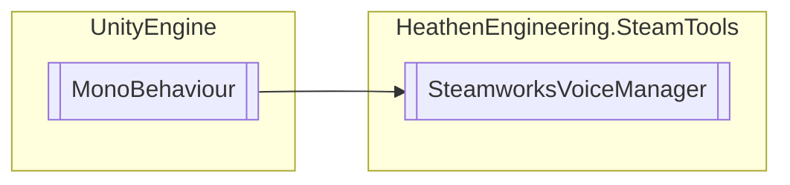

# SteamworksVoiceManager `Public class`

## Diagram


## Members
### Properties
#### Public  properties
| Type | Name | Methods |
| --- | --- | --- |
| `bool` | [`IsRecording`](#isrecording) | `get` |

### Methods
#### Public  methods
| Returns | Name |
| --- | --- |
| `void` | [`PlayVoiceData`](#playvoicedata)(`byte``[]` buffer) |
| `void` | [`StartRecording`](#startrecording)() |
| `void` | [`StopRecording`](#stoprecording)() |

## Details
### Inheritance
 - `MonoBehaviour`

### Constructors
#### SteamworksVoiceManager
```csharp
public SteamworksVoiceManager()
```

### Methods
#### StartRecording
```csharp
public void StartRecording()
```

#### StopRecording
```csharp
public void StopRecording()
```

#### PlayVoiceData
```csharp
public void PlayVoiceData(byte[] buffer)
```
##### Arguments
| Type | Name | Description |
| --- | --- | --- |
| `byte``[]` | buffer |   |

### Properties
#### IsRecording
```csharp
public bool IsRecording { get; }
```

*Generated with* [*ModularDoc*](https://github.com/hailstorm75/ModularDoc)
