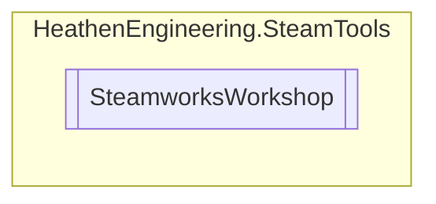

# SteamworksWorkshop `Public class`

## Diagram


## Members
### Methods
#### Public Static methods
| Returns | Name |
| --- | --- |
| `void` | [`RegisterWorkshopSystem`](#registerworkshopsystem)() |
| `void` | [`WorkshopAddAppDependency`](#workshopaddappdependency)(`PublishedFileId_t` fileId, `AppId_t` appId) |
| `void` | [`WorkshopAddDependency`](#workshopadddependency)(`PublishedFileId_t` parentFileId, `PublishedFileId_t` childFileId) |
| `bool` | [`WorkshopAddExcludedTag`](#workshopaddexcludedtag)(`UGCQueryHandle_t` handle, `string` tagName) |
| `bool` | [`WorkshopAddItemKeyValueTag`](#workshopadditemkeyvaluetag)(`UGCUpdateHandle_t` handle, `string` key, `string` value) |
| `bool` | [`WorkshopAddItemPreviewFile`](#workshopadditempreviewfile)(`UGCUpdateHandle_t` handle, `string` previewFile, `EItemPreviewType` type) |
| `bool` | [`WorkshopAddItemPreviewVideo`](#workshopadditempreviewvideo)(`UGCUpdateHandle_t` handle, `string` videoId) |
| `void` | [`WorkshopAddItemToFavorites`](#workshopadditemtofavorites)(`AppId_t` appId, `PublishedFileId_t` fileId) |
| `bool` | [`WorkshopAddRequiredKeyValueTag`](#workshopaddrequiredkeyvaluetag)(`UGCQueryHandle_t` handle, `string` key, `string` value) |
| `bool` | [`WorkshopAddRequiredTag`](#workshopaddrequiredtag)(`UGCQueryHandle_t` handle, `string` tagName) |
| `void` | [`WorkshopCreateItem`](#workshopcreateitem)(`AppId_t` appId, `EWorkshopFileType` type) |
| `UGCQueryHandle_t` | [`WorkshopCreateQueryAllRequest`](#workshopcreatequeryallrequest)(`EUGCQuery` queryType, `EUGCMatchingUGCType` matchingFileType, `AppId_t` creatorAppId, `AppId_t` consumerAppId, `uint` page) |
| `UGCQueryHandle_t` | [`WorkshopCreateQueryDetailsRequest`](#workshopcreatequerydetailsrequest-13)(`...`) |
| `UGCQueryHandle_t` | [`WorkshopCreateQueryUserRequest`](#workshopcreatequeryuserrequest)(`AccountID_t` accountId, `EUserUGCList` listType, `EUGCMatchingUGCType` matchingType, `EUserUGCListSortOrder` sortOrder, `AppId_t` creatorAppId, `AppId_t` consumerAppId, `uint` page) |
| `void` | [`WorkshopDeleteItem`](#workshopdeleteitem)(`PublishedFileId_t` fileId) |
| `bool` | [`WorkshopDownloadItem`](#workshopdownloaditem)(`PublishedFileId_t` fileId, `bool` setHighPriority) |
| `bool` | [`WorkshopGeQueryUGCKeyValueTag`](#workshopgequeryugckeyvaluetag)(`UGCQueryHandle_t` handle, `uint` index, `uint` keyValueTagIndex, out `string` key, `uint` keySize, `string` value, `uint` valueSize) |
| `void` | [`WorkshopGetAppDependencies`](#workshopgetappdependencies)(`PublishedFileId_t` fileId) |
| `bool` | [`WorkshopGetItemDownloadInfo`](#workshopgetitemdownloadinfo)(`PublishedFileId_t` fileId, out `float` completion) |
| `bool` | [`WorkshopGetItemInstallInfo`](#workshopgetiteminstallinfo)(`PublishedFileId_t` fileId, out `ulong` sizeOnDisk, out `string` folderPath, `uint` folderSize, out `DateTime` timeStamp) |
| `EItemState` | [`WorkshopGetItemState`](#workshopgetitemstate)(`PublishedFileId_t` fileId) |
| `EItemUpdateStatus` | [`WorkshopGetItemUpdateProgress`](#workshopgetitemupdateprogress)(`UGCUpdateHandle_t` handle, out `float` completion) |
| `uint` | [`WorkshopGetNumSubscribedItems`](#workshopgetnumsubscribeditems)() |
| `bool` | [`WorkshopGetQueryUGCAdditionalPreview`](#workshopgetqueryugcadditionalpreview)(`UGCQueryHandle_t` handle, `uint` index, `uint` previewIndex, out `string` urlOrVideoId, `uint` urlOrVideoSize, `string` fileName, `uint` fileNameSize, out `EItemPreviewType` type) |
| `bool` | [`WorkshopGetQueryUGCChildren`](#workshopgetqueryugcchildren)(`UGCQueryHandle_t` handle, `uint` index, `PublishedFileId_t``[]` fileIds, `uint` maxEntries) |
| `bool` | [`WorkshopGetQueryUGCMetadata`](#workshopgetqueryugcmetadata)(`UGCQueryHandle_t` handle, `uint` index, out `string` metadata, `uint` size) |
| `uint` | [`WorkshopGetQueryUGCNumAdditionalPreviews`](#workshopgetqueryugcnumadditionalpreviews)(`UGCQueryHandle_t` handle, `uint` index) |
| `uint` | [`WorkshopGetQueryUGCNumKeyValueTags`](#workshopgetqueryugcnumkeyvaluetags)(`UGCQueryHandle_t` handle, `uint` index) |
| `bool` | [`WorkshopGetQueryUGCPreviewURL`](#workshopgetqueryugcpreviewurl)(`UGCQueryHandle_t` handle, `uint` index, out `string` URL, `uint` urlSize) |
| `bool` | [`WorkshopGetQueryUGCResult`](#workshopgetqueryugcresult)(`UGCQueryHandle_t` handle, `uint` index, out `SteamUGCDetails_t` details) |
| `bool` | [`WorkshopGetQueryUGCStatistic`](#workshopgetqueryugcstatistic)(`UGCQueryHandle_t` handle, `uint` index, `EItemStatistic` statType, out `ulong` statValue) |
| `uint` | [`WorkshopGetSubscribedItems`](#workshopgetsubscribeditems)(`PublishedFileId_t``[]` fileIDs, `uint` maxEntries) |
| `void` | [`WorkshopGetUserItemVote`](#workshopgetuseritemvote)(`PublishedFileId_t` fileId) |
| `bool` | [`WorkshopItemStateHasAllFlags`](#workshopitemstatehasallflags)(`EItemState` value, `EItemState``[]` checkflags) |
| `bool` | [`WorkshopItemStateHasFlag`](#workshopitemstatehasflag)(`EItemState` value, `EItemState` checkflag) |
| `bool` | [`WorkshopReleaseQueryRequest`](#workshopreleasequeryrequest)(`UGCQueryHandle_t` handle) |
| `void` | [`WorkshopRemoveAppDependency`](#workshopremoveappdependency)(`PublishedFileId_t` fileId, `AppId_t` appId) |
| `void` | [`WorkshopRemoveDependency`](#workshopremovedependency)(`PublishedFileId_t` parentFileId, `PublishedFileId_t` childFileId) |
| `void` | [`WorkshopRemoveItemFromFavorites`](#workshopremoveitemfromfavorites)(`AppId_t` appId, `PublishedFileId_t` fileId) |
| `bool` | [`WorkshopRemoveItemKeyValueTags`](#workshopremoveitemkeyvaluetags)(`UGCUpdateHandle_t` handle, `string` key) |
| `bool` | [`WorkshopRemoveItemPreview`](#workshopremoveitempreview)(`UGCUpdateHandle_t` handle, `uint` index) |
| `void` | [`WorkshopRequestDetails`](#workshoprequestdetails)(`PublishedFileId_t` fileId, `uint` maxAgeSeconds) |
| `void` | [`WorkshopSendQueryUGCRequest`](#workshopsendqueryugcrequest)(`UGCQueryHandle_t` handle) |
| `bool` | [`WorkshopSetAllowCachedResponse`](#workshopsetallowcachedresponse)(`UGCQueryHandle_t` handle, `uint` maxAgeSeconds) |
| `bool` | [`WorkshopSetCloudFileNameFilter`](#workshopsetcloudfilenamefilter)(`UGCQueryHandle_t` handle, `string` fileName) |
| `bool` | [`WorkshopSetItemContent`](#workshopsetitemcontent)(`UGCUpdateHandle_t` handle, `string` folder) |
| `bool` | [`WorkshopSetItemDescription`](#workshopsetitemdescription)(`UGCUpdateHandle_t` handle, `string` description) |
| `bool` | [`WorkshopSetItemMetadata`](#workshopsetitemmetadata)(`UGCUpdateHandle_t` handle, `string` metadata) |
| `bool` | [`WorkshopSetItemPreview`](#workshopsetitempreview)(`UGCUpdateHandle_t` handle, `string` previewFile) |
| `bool` | [`WorkshopSetItemTags`](#workshopsetitemtags)(`UGCUpdateHandle_t` handle, `List`&lt;`string`&gt; tags) |
| `bool` | [`WorkshopSetItemTitle`](#workshopsetitemtitle)(`UGCUpdateHandle_t` handle, `string` title) |
| `bool` | [`WorkshopSetItemUpdateLanguage`](#workshopsetitemupdatelanguage)(`UGCUpdateHandle_t` handle, `string` language) |
| `bool` | [`WorkshopSetItemVisibility`](#workshopsetitemvisibility)(`UGCUpdateHandle_t` handle, `ERemoteStoragePublishedFileVisibility` visibility) |
| `bool` | [`WorkshopSetLanguage`](#workshopsetlanguage)(`UGCQueryHandle_t` handle, `string` language) |
| `bool` | [`WorkshopSetMatchAnyTag`](#workshopsetmatchanytag)(`UGCQueryHandle_t` handle, `bool` anyTag) |
| `bool` | [`WorkshopSetRankedByTrendDays`](#workshopsetrankedbytrenddays)(`UGCQueryHandle_t` handle, `uint` days) |
| `bool` | [`WorkshopSetReturnAdditionalPreviews`](#workshopsetreturnadditionalpreviews)(`UGCQueryHandle_t` handle, `bool` additionalPreviews) |
| `bool` | [`WorkshopSetReturnChildren`](#workshopsetreturnchildren)(`UGCQueryHandle_t` handle, `bool` returnChildren) |
| `bool` | [`WorkshopSetReturnKeyValueTags`](#workshopsetreturnkeyvaluetags)(`UGCQueryHandle_t` handle, `bool` tags) |
| `bool` | [`WorkshopSetReturnLongDescription`](#workshopsetreturnlongdescription)(`UGCQueryHandle_t` handle, `bool` longDescription) |
| `bool` | [`WorkshopSetReturnMetadata`](#workshopsetreturnmetadata)(`UGCQueryHandle_t` handle, `bool` metadata) |
| `bool` | [`WorkshopSetReturnOnlyIDs`](#workshopsetreturnonlyids)(`UGCQueryHandle_t` handle, `bool` onlyIds) |
| `bool` | [`WorkshopSetReturnPlaytimeStats`](#workshopsetreturnplaytimestats)(`UGCQueryHandle_t` handle, `uint` days) |
| `bool` | [`WorkshopSetReturnTotalOnly`](#workshopsetreturntotalonly)(`UGCQueryHandle_t` handle, `bool` totalOnly) |
| `bool` | [`WorkshopSetSearchText`](#workshopsetsearchtext)(`UGCQueryHandle_t` handle, `string` text) |
| `void` | [`WorkshopSetUserItemVote`](#workshopsetuseritemvote)(`PublishedFileId_t` fileID, `bool` voteUp) |
| `UGCUpdateHandle_t` | [`WorkshopStartItemUpdate`](#workshopstartitemupdate)(`AppId_t` appId, `PublishedFileId_t` fileID) |
| `void` | [`WorkshopStartPlaytimeTracking`](#workshopstartplaytimetracking)(`PublishedFileId_t``[]` fileIds, `uint` count) |
| `void` | [`WorkshopStopPlaytimeTracking`](#workshopstopplaytimetracking)(`PublishedFileId_t``[]` fileIds, `uint` count) |
| `void` | [`WorkshopStopPlaytimeTrackingForAllItems`](#workshopstopplaytimetrackingforallitems)() |
| `void` | [`WorkshopSubmitItemUpdate`](#workshopsubmititemupdate)(`UGCUpdateHandle_t` handle, `string` changeNote) |
| `void` | [`WorkshopSubscribeItem`](#workshopsubscribeitem)(`PublishedFileId_t` fileId) |
| `void` | [`WorkshopSuspendDownloads`](#workshopsuspenddownloads)(`bool` suspend) |
| `void` | [`WorkshopUnsubscribeItem`](#workshopunsubscribeitem)(`PublishedFileId_t` fileId) |
| `bool` | [`WorkshopUpdateItemPreviewFile`](#workshopupdateitempreviewfile)(`UGCUpdateHandle_t` handle, `uint` index, `string` file) |
| `bool` | [`WorkshopUpdateItemPreviewVideo`](#workshopupdateitempreviewvideo)(`UGCUpdateHandle_t` handle, `uint` index, `string` videoId) |

## Details
### Methods
#### RegisterWorkshopSystem
```csharp
public static void RegisterWorkshopSystem()
```

#### WorkshopAddAppDependency
```csharp
public static void WorkshopAddAppDependency(PublishedFileId_t fileId, AppId_t appId)
```
##### Arguments
| Type | Name | Description |
| --- | --- | --- |
| `PublishedFileId_t` | fileId |   |
| `AppId_t` | appId |   |

#### WorkshopAddDependency
```csharp
public static void WorkshopAddDependency(PublishedFileId_t parentFileId, PublishedFileId_t childFileId)
```
##### Arguments
| Type | Name | Description |
| --- | --- | --- |
| `PublishedFileId_t` | parentFileId |   |
| `PublishedFileId_t` | childFileId |   |

#### WorkshopAddExcludedTag
```csharp
public static bool WorkshopAddExcludedTag(UGCQueryHandle_t handle, string tagName)
```
##### Arguments
| Type | Name | Description |
| --- | --- | --- |
| `UGCQueryHandle_t` | handle |   |
| `string` | tagName |   |

#### WorkshopAddItemKeyValueTag
```csharp
public static bool WorkshopAddItemKeyValueTag(UGCUpdateHandle_t handle, string key, string value)
```
##### Arguments
| Type | Name | Description |
| --- | --- | --- |
| `UGCUpdateHandle_t` | handle |   |
| `string` | key |   |
| `string` | value |   |

#### WorkshopAddItemPreviewFile
```csharp
public static bool WorkshopAddItemPreviewFile(UGCUpdateHandle_t handle, string previewFile, EItemPreviewType type)
```
##### Arguments
| Type | Name | Description |
| --- | --- | --- |
| `UGCUpdateHandle_t` | handle |   |
| `string` | previewFile |   |
| `EItemPreviewType` | type |   |

#### WorkshopAddItemPreviewVideo
```csharp
public static bool WorkshopAddItemPreviewVideo(UGCUpdateHandle_t handle, string videoId)
```
##### Arguments
| Type | Name | Description |
| --- | --- | --- |
| `UGCUpdateHandle_t` | handle |   |
| `string` | videoId |   |

#### WorkshopAddItemToFavorites
```csharp
public static void WorkshopAddItemToFavorites(AppId_t appId, PublishedFileId_t fileId)
```
##### Arguments
| Type | Name | Description |
| --- | --- | --- |
| `AppId_t` | appId |   |
| `PublishedFileId_t` | fileId |   |

#### WorkshopAddRequiredKeyValueTag
```csharp
public static bool WorkshopAddRequiredKeyValueTag(UGCQueryHandle_t handle, string key, string value)
```
##### Arguments
| Type | Name | Description |
| --- | --- | --- |
| `UGCQueryHandle_t` | handle |   |
| `string` | key |   |
| `string` | value |   |

#### WorkshopAddRequiredTag
```csharp
public static bool WorkshopAddRequiredTag(UGCQueryHandle_t handle, string tagName)
```
##### Arguments
| Type | Name | Description |
| --- | --- | --- |
| `UGCQueryHandle_t` | handle |   |
| `string` | tagName |   |

#### WorkshopCreateItem
```csharp
public static void WorkshopCreateItem(AppId_t appId, EWorkshopFileType type)
```
##### Arguments
| Type | Name | Description |
| --- | --- | --- |
| `AppId_t` | appId |   |
| `EWorkshopFileType` | type |   |

#### WorkshopCreateQueryAllRequest
```csharp
public static UGCQueryHandle_t WorkshopCreateQueryAllRequest(EUGCQuery queryType, EUGCMatchingUGCType matchingFileType, AppId_t creatorAppId, AppId_t consumerAppId, uint page)
```
##### Arguments
| Type | Name | Description |
| --- | --- | --- |
| `EUGCQuery` | queryType |   |
| `EUGCMatchingUGCType` | matchingFileType |   |
| `AppId_t` | creatorAppId |   |
| `AppId_t` | consumerAppId |   |
| `uint` | page |   |

#### WorkshopCreateQueryDetailsRequest [1/3]
```csharp
public static UGCQueryHandle_t WorkshopCreateQueryDetailsRequest(PublishedFileId_t[] fileIds)
```
##### Arguments
| Type | Name | Description |
| --- | --- | --- |
| `PublishedFileId_t``[]` | fileIds |   |

#### WorkshopCreateQueryDetailsRequest [2/3]
```csharp
public static UGCQueryHandle_t WorkshopCreateQueryDetailsRequest(List<PublishedFileId_t> fileIds)
```
##### Arguments
| Type | Name | Description |
| --- | --- | --- |
| `List`&lt;`PublishedFileId_t`&gt; | fileIds |   |

#### WorkshopCreateQueryDetailsRequest [3/3]
```csharp
public static UGCQueryHandle_t WorkshopCreateQueryDetailsRequest(IEnumerable<PublishedFileId_t> fileIds)
```
##### Arguments
| Type | Name | Description |
| --- | --- | --- |
| `IEnumerable`&lt;`PublishedFileId_t`&gt; | fileIds |   |

#### WorkshopCreateQueryUserRequest
```csharp
public static UGCQueryHandle_t WorkshopCreateQueryUserRequest(AccountID_t accountId, EUserUGCList listType, EUGCMatchingUGCType matchingType, EUserUGCListSortOrder sortOrder, AppId_t creatorAppId, AppId_t consumerAppId, uint page)
```
##### Arguments
| Type | Name | Description |
| --- | --- | --- |
| `AccountID_t` | accountId |   |
| `EUserUGCList` | listType |   |
| `EUGCMatchingUGCType` | matchingType |   |
| `EUserUGCListSortOrder` | sortOrder |   |
| `AppId_t` | creatorAppId |   |
| `AppId_t` | consumerAppId |   |
| `uint` | page |   |

#### WorkshopReleaseQueryRequest
```csharp
public static bool WorkshopReleaseQueryRequest(UGCQueryHandle_t handle)
```
##### Arguments
| Type | Name | Description |
| --- | --- | --- |
| `UGCQueryHandle_t` | handle |   |

#### WorkshopDeleteItem
```csharp
public static void WorkshopDeleteItem(PublishedFileId_t fileId)
```
##### Arguments
| Type | Name | Description |
| --- | --- | --- |
| `PublishedFileId_t` | fileId |   |

#### WorkshopDownloadItem
```csharp
public static bool WorkshopDownloadItem(PublishedFileId_t fileId, bool setHighPriority)
```
##### Arguments
| Type | Name | Description |
| --- | --- | --- |
| `PublishedFileId_t` | fileId |   |
| `bool` | setHighPriority |   |

#### WorkshopGetAppDependencies
```csharp
public static void WorkshopGetAppDependencies(PublishedFileId_t fileId)
```
##### Arguments
| Type | Name | Description |
| --- | --- | --- |
| `PublishedFileId_t` | fileId |   |

#### WorkshopGetItemDownloadInfo
```csharp
public static bool WorkshopGetItemDownloadInfo(PublishedFileId_t fileId, out float completion)
```
##### Arguments
| Type | Name | Description |
| --- | --- | --- |
| `PublishedFileId_t` | fileId |   |
| `out` `float` | completion |   |

#### WorkshopGetItemInstallInfo
```csharp
public static bool WorkshopGetItemInstallInfo(PublishedFileId_t fileId, out ulong sizeOnDisk, out string folderPath, uint folderSize, out DateTime timeStamp)
```
##### Arguments
| Type | Name | Description |
| --- | --- | --- |
| `PublishedFileId_t` | fileId |   |
| `out` `ulong` | sizeOnDisk |   |
| `out` `string` | folderPath |   |
| `uint` | folderSize |   |
| `out` `DateTime` | timeStamp |   |

#### WorkshopGetItemState
```csharp
public static EItemState WorkshopGetItemState(PublishedFileId_t fileId)
```
##### Arguments
| Type | Name | Description |
| --- | --- | --- |
| `PublishedFileId_t` | fileId |   |

#### WorkshopItemStateHasFlag
```csharp
public static bool WorkshopItemStateHasFlag(EItemState value, EItemState checkflag)
```
##### Arguments
| Type | Name | Description |
| --- | --- | --- |
| `EItemState` | value |   |
| `EItemState` | checkflag |   |

#### WorkshopItemStateHasAllFlags
```csharp
public static bool WorkshopItemStateHasAllFlags(EItemState value, EItemState[] checkflags)
```
##### Arguments
| Type | Name | Description |
| --- | --- | --- |
| `EItemState` | value |   |
| `EItemState``[]` | checkflags |   |

#### WorkshopGetItemUpdateProgress
```csharp
public static EItemUpdateStatus WorkshopGetItemUpdateProgress(UGCUpdateHandle_t handle, out float completion)
```
##### Arguments
| Type | Name | Description |
| --- | --- | --- |
| `UGCUpdateHandle_t` | handle |   |
| `out` `float` | completion |   |

#### WorkshopGetNumSubscribedItems
```csharp
public static uint WorkshopGetNumSubscribedItems()
```

#### WorkshopGetQueryUGCAdditionalPreview
```csharp
public static bool WorkshopGetQueryUGCAdditionalPreview(UGCQueryHandle_t handle, uint index, uint previewIndex, out string urlOrVideoId, uint urlOrVideoSize, string fileName, uint fileNameSize, out EItemPreviewType type)
```
##### Arguments
| Type | Name | Description |
| --- | --- | --- |
| `UGCQueryHandle_t` | handle |   |
| `uint` | index |   |
| `uint` | previewIndex |   |
| `out` `string` | urlOrVideoId |   |
| `uint` | urlOrVideoSize |   |
| `string` | fileName |   |
| `uint` | fileNameSize |   |
| `out` `EItemPreviewType` | type |   |

#### WorkshopGetQueryUGCChildren
```csharp
public static bool WorkshopGetQueryUGCChildren(UGCQueryHandle_t handle, uint index, PublishedFileId_t[] fileIds, uint maxEntries)
```
##### Arguments
| Type | Name | Description |
| --- | --- | --- |
| `UGCQueryHandle_t` | handle |   |
| `uint` | index |   |
| `PublishedFileId_t``[]` | fileIds |   |
| `uint` | maxEntries |   |

#### WorkshopGeQueryUGCKeyValueTag
```csharp
public static bool WorkshopGeQueryUGCKeyValueTag(UGCQueryHandle_t handle, uint index, uint keyValueTagIndex, out string key, uint keySize, string value, uint valueSize)
```
##### Arguments
| Type | Name | Description |
| --- | --- | --- |
| `UGCQueryHandle_t` | handle |   |
| `uint` | index |   |
| `uint` | keyValueTagIndex |   |
| `out` `string` | key |   |
| `uint` | keySize |   |
| `string` | value |   |
| `uint` | valueSize |   |

#### WorkshopGetQueryUGCMetadata
```csharp
public static bool WorkshopGetQueryUGCMetadata(UGCQueryHandle_t handle, uint index, out string metadata, uint size)
```
##### Arguments
| Type | Name | Description |
| --- | --- | --- |
| `UGCQueryHandle_t` | handle |   |
| `uint` | index |   |
| `out` `string` | metadata |   |
| `uint` | size |   |

#### WorkshopGetQueryUGCNumAdditionalPreviews
```csharp
public static uint WorkshopGetQueryUGCNumAdditionalPreviews(UGCQueryHandle_t handle, uint index)
```
##### Arguments
| Type | Name | Description |
| --- | --- | --- |
| `UGCQueryHandle_t` | handle |   |
| `uint` | index |   |

#### WorkshopGetQueryUGCNumKeyValueTags
```csharp
public static uint WorkshopGetQueryUGCNumKeyValueTags(UGCQueryHandle_t handle, uint index)
```
##### Arguments
| Type | Name | Description |
| --- | --- | --- |
| `UGCQueryHandle_t` | handle |   |
| `uint` | index |   |

#### WorkshopGetQueryUGCPreviewURL
```csharp
public static bool WorkshopGetQueryUGCPreviewURL(UGCQueryHandle_t handle, uint index, out string URL, uint urlSize)
```
##### Arguments
| Type | Name | Description |
| --- | --- | --- |
| `UGCQueryHandle_t` | handle |   |
| `uint` | index |   |
| `out` `string` | URL |   |
| `uint` | urlSize |   |

#### WorkshopGetQueryUGCResult
```csharp
public static bool WorkshopGetQueryUGCResult(UGCQueryHandle_t handle, uint index, out SteamUGCDetails_t details)
```
##### Arguments
| Type | Name | Description |
| --- | --- | --- |
| `UGCQueryHandle_t` | handle |   |
| `uint` | index |   |
| `out` `SteamUGCDetails_t` | details |   |

#### WorkshopGetQueryUGCStatistic
```csharp
public static bool WorkshopGetQueryUGCStatistic(UGCQueryHandle_t handle, uint index, EItemStatistic statType, out ulong statValue)
```
##### Arguments
| Type | Name | Description |
| --- | --- | --- |
| `UGCQueryHandle_t` | handle |   |
| `uint` | index |   |
| `EItemStatistic` | statType |   |
| `out` `ulong` | statValue |   |

#### WorkshopGetSubscribedItems
```csharp
public static uint WorkshopGetSubscribedItems(PublishedFileId_t[] fileIDs, uint maxEntries)
```
##### Arguments
| Type | Name | Description |
| --- | --- | --- |
| `PublishedFileId_t``[]` | fileIDs |   |
| `uint` | maxEntries |   |

#### WorkshopGetUserItemVote
```csharp
public static void WorkshopGetUserItemVote(PublishedFileId_t fileId)
```
##### Arguments
| Type | Name | Description |
| --- | --- | --- |
| `PublishedFileId_t` | fileId |   |

#### WorkshopRemoveAppDependency
```csharp
public static void WorkshopRemoveAppDependency(PublishedFileId_t fileId, AppId_t appId)
```
##### Arguments
| Type | Name | Description |
| --- | --- | --- |
| `PublishedFileId_t` | fileId |   |
| `AppId_t` | appId |   |

#### WorkshopRemoveDependency
```csharp
public static void WorkshopRemoveDependency(PublishedFileId_t parentFileId, PublishedFileId_t childFileId)
```
##### Arguments
| Type | Name | Description |
| --- | --- | --- |
| `PublishedFileId_t` | parentFileId |   |
| `PublishedFileId_t` | childFileId |   |

#### WorkshopRemoveItemFromFavorites
```csharp
public static void WorkshopRemoveItemFromFavorites(AppId_t appId, PublishedFileId_t fileId)
```
##### Arguments
| Type | Name | Description |
| --- | --- | --- |
| `AppId_t` | appId |   |
| `PublishedFileId_t` | fileId |   |

#### WorkshopRemoveItemKeyValueTags
```csharp
public static bool WorkshopRemoveItemKeyValueTags(UGCUpdateHandle_t handle, string key)
```
##### Arguments
| Type | Name | Description |
| --- | --- | --- |
| `UGCUpdateHandle_t` | handle |   |
| `string` | key |   |

#### WorkshopRemoveItemPreview
```csharp
public static bool WorkshopRemoveItemPreview(UGCUpdateHandle_t handle, uint index)
```
##### Arguments
| Type | Name | Description |
| --- | --- | --- |
| `UGCUpdateHandle_t` | handle |   |
| `uint` | index |   |

#### WorkshopRequestDetails
```csharp
public static void WorkshopRequestDetails(PublishedFileId_t fileId, uint maxAgeSeconds)
```
##### Arguments
| Type | Name | Description |
| --- | --- | --- |
| `PublishedFileId_t` | fileId |   |
| `uint` | maxAgeSeconds |   |

#### WorkshopSendQueryUGCRequest
```csharp
public static void WorkshopSendQueryUGCRequest(UGCQueryHandle_t handle)
```
##### Arguments
| Type | Name | Description |
| --- | --- | --- |
| `UGCQueryHandle_t` | handle |   |

#### WorkshopSetAllowCachedResponse
```csharp
public static bool WorkshopSetAllowCachedResponse(UGCQueryHandle_t handle, uint maxAgeSeconds)
```
##### Arguments
| Type | Name | Description |
| --- | --- | --- |
| `UGCQueryHandle_t` | handle |   |
| `uint` | maxAgeSeconds |   |

#### WorkshopSetCloudFileNameFilter
```csharp
public static bool WorkshopSetCloudFileNameFilter(UGCQueryHandle_t handle, string fileName)
```
##### Arguments
| Type | Name | Description |
| --- | --- | --- |
| `UGCQueryHandle_t` | handle |   |
| `string` | fileName |   |

#### WorkshopSetItemContent
```csharp
public static bool WorkshopSetItemContent(UGCUpdateHandle_t handle, string folder)
```
##### Arguments
| Type | Name | Description |
| --- | --- | --- |
| `UGCUpdateHandle_t` | handle |   |
| `string` | folder |   |

#### WorkshopSetItemDescription
```csharp
public static bool WorkshopSetItemDescription(UGCUpdateHandle_t handle, string description)
```
##### Arguments
| Type | Name | Description |
| --- | --- | --- |
| `UGCUpdateHandle_t` | handle |   |
| `string` | description |   |

#### WorkshopSetItemMetadata
```csharp
public static bool WorkshopSetItemMetadata(UGCUpdateHandle_t handle, string metadata)
```
##### Arguments
| Type | Name | Description |
| --- | --- | --- |
| `UGCUpdateHandle_t` | handle |   |
| `string` | metadata |   |

#### WorkshopSetItemPreview
```csharp
public static bool WorkshopSetItemPreview(UGCUpdateHandle_t handle, string previewFile)
```
##### Arguments
| Type | Name | Description |
| --- | --- | --- |
| `UGCUpdateHandle_t` | handle |   |
| `string` | previewFile |   |

#### WorkshopSetItemTags
```csharp
public static bool WorkshopSetItemTags(UGCUpdateHandle_t handle, List<string> tags)
```
##### Arguments
| Type | Name | Description |
| --- | --- | --- |
| `UGCUpdateHandle_t` | handle |   |
| `List`&lt;`string`&gt; | tags |   |

#### WorkshopSetItemTitle
```csharp
public static bool WorkshopSetItemTitle(UGCUpdateHandle_t handle, string title)
```
##### Arguments
| Type | Name | Description |
| --- | --- | --- |
| `UGCUpdateHandle_t` | handle |   |
| `string` | title |   |

#### WorkshopSetItemUpdateLanguage
```csharp
public static bool WorkshopSetItemUpdateLanguage(UGCUpdateHandle_t handle, string language)
```
##### Arguments
| Type | Name | Description |
| --- | --- | --- |
| `UGCUpdateHandle_t` | handle |   |
| `string` | language |   |

#### WorkshopSetItemVisibility
```csharp
public static bool WorkshopSetItemVisibility(UGCUpdateHandle_t handle, ERemoteStoragePublishedFileVisibility visibility)
```
##### Arguments
| Type | Name | Description |
| --- | --- | --- |
| `UGCUpdateHandle_t` | handle |   |
| `ERemoteStoragePublishedFileVisibility` | visibility |   |

#### WorkshopSetLanguage
```csharp
public static bool WorkshopSetLanguage(UGCQueryHandle_t handle, string language)
```
##### Arguments
| Type | Name | Description |
| --- | --- | --- |
| `UGCQueryHandle_t` | handle |   |
| `string` | language |   |

#### WorkshopSetMatchAnyTag
```csharp
public static bool WorkshopSetMatchAnyTag(UGCQueryHandle_t handle, bool anyTag)
```
##### Arguments
| Type | Name | Description |
| --- | --- | --- |
| `UGCQueryHandle_t` | handle |   |
| `bool` | anyTag |   |

#### WorkshopSetRankedByTrendDays
```csharp
public static bool WorkshopSetRankedByTrendDays(UGCQueryHandle_t handle, uint days)
```
##### Arguments
| Type | Name | Description |
| --- | --- | --- |
| `UGCQueryHandle_t` | handle |   |
| `uint` | days |   |

#### WorkshopSetReturnAdditionalPreviews
```csharp
public static bool WorkshopSetReturnAdditionalPreviews(UGCQueryHandle_t handle, bool additionalPreviews)
```
##### Arguments
| Type | Name | Description |
| --- | --- | --- |
| `UGCQueryHandle_t` | handle |   |
| `bool` | additionalPreviews |   |

#### WorkshopSetReturnChildren
```csharp
public static bool WorkshopSetReturnChildren(UGCQueryHandle_t handle, bool returnChildren)
```
##### Arguments
| Type | Name | Description |
| --- | --- | --- |
| `UGCQueryHandle_t` | handle |   |
| `bool` | returnChildren |   |

#### WorkshopSetReturnKeyValueTags
```csharp
public static bool WorkshopSetReturnKeyValueTags(UGCQueryHandle_t handle, bool tags)
```
##### Arguments
| Type | Name | Description |
| --- | --- | --- |
| `UGCQueryHandle_t` | handle |   |
| `bool` | tags |   |

#### WorkshopSetReturnLongDescription
```csharp
public static bool WorkshopSetReturnLongDescription(UGCQueryHandle_t handle, bool longDescription)
```
##### Arguments
| Type | Name | Description |
| --- | --- | --- |
| `UGCQueryHandle_t` | handle |   |
| `bool` | longDescription |   |

#### WorkshopSetReturnMetadata
```csharp
public static bool WorkshopSetReturnMetadata(UGCQueryHandle_t handle, bool metadata)
```
##### Arguments
| Type | Name | Description |
| --- | --- | --- |
| `UGCQueryHandle_t` | handle |   |
| `bool` | metadata |   |

#### WorkshopSetReturnOnlyIDs
```csharp
public static bool WorkshopSetReturnOnlyIDs(UGCQueryHandle_t handle, bool onlyIds)
```
##### Arguments
| Type | Name | Description |
| --- | --- | --- |
| `UGCQueryHandle_t` | handle |   |
| `bool` | onlyIds |   |

#### WorkshopSetReturnPlaytimeStats
```csharp
public static bool WorkshopSetReturnPlaytimeStats(UGCQueryHandle_t handle, uint days)
```
##### Arguments
| Type | Name | Description |
| --- | --- | --- |
| `UGCQueryHandle_t` | handle |   |
| `uint` | days |   |

#### WorkshopSetReturnTotalOnly
```csharp
public static bool WorkshopSetReturnTotalOnly(UGCQueryHandle_t handle, bool totalOnly)
```
##### Arguments
| Type | Name | Description |
| --- | --- | --- |
| `UGCQueryHandle_t` | handle |   |
| `bool` | totalOnly |   |

#### WorkshopSetSearchText
```csharp
public static bool WorkshopSetSearchText(UGCQueryHandle_t handle, string text)
```
##### Arguments
| Type | Name | Description |
| --- | --- | --- |
| `UGCQueryHandle_t` | handle |   |
| `string` | text |   |

#### WorkshopSetUserItemVote
```csharp
public static void WorkshopSetUserItemVote(PublishedFileId_t fileID, bool voteUp)
```
##### Arguments
| Type | Name | Description |
| --- | --- | --- |
| `PublishedFileId_t` | fileID |   |
| `bool` | voteUp |   |

#### WorkshopStartItemUpdate
```csharp
public static UGCUpdateHandle_t WorkshopStartItemUpdate(AppId_t appId, PublishedFileId_t fileID)
```
##### Arguments
| Type | Name | Description |
| --- | --- | --- |
| `AppId_t` | appId |   |
| `PublishedFileId_t` | fileID |   |

#### WorkshopStartPlaytimeTracking
```csharp
public static void WorkshopStartPlaytimeTracking(PublishedFileId_t[] fileIds, uint count)
```
##### Arguments
| Type | Name | Description |
| --- | --- | --- |
| `PublishedFileId_t``[]` | fileIds |   |
| `uint` | count |   |

#### WorkshopStopPlaytimeTracking
```csharp
public static void WorkshopStopPlaytimeTracking(PublishedFileId_t[] fileIds, uint count)
```
##### Arguments
| Type | Name | Description |
| --- | --- | --- |
| `PublishedFileId_t``[]` | fileIds |   |
| `uint` | count |   |

#### WorkshopStopPlaytimeTrackingForAllItems
```csharp
public static void WorkshopStopPlaytimeTrackingForAllItems()
```

#### WorkshopSubmitItemUpdate
```csharp
public static void WorkshopSubmitItemUpdate(UGCUpdateHandle_t handle, string changeNote)
```
##### Arguments
| Type | Name | Description |
| --- | --- | --- |
| `UGCUpdateHandle_t` | handle |   |
| `string` | changeNote |   |

#### WorkshopSubscribeItem
```csharp
public static void WorkshopSubscribeItem(PublishedFileId_t fileId)
```
##### Arguments
| Type | Name | Description |
| --- | --- | --- |
| `PublishedFileId_t` | fileId |   |

#### WorkshopSuspendDownloads
```csharp
public static void WorkshopSuspendDownloads(bool suspend)
```
##### Arguments
| Type | Name | Description |
| --- | --- | --- |
| `bool` | suspend |   |

#### WorkshopUnsubscribeItem
```csharp
public static void WorkshopUnsubscribeItem(PublishedFileId_t fileId)
```
##### Arguments
| Type | Name | Description |
| --- | --- | --- |
| `PublishedFileId_t` | fileId |   |

#### WorkshopUpdateItemPreviewFile
```csharp
public static bool WorkshopUpdateItemPreviewFile(UGCUpdateHandle_t handle, uint index, string file)
```
##### Arguments
| Type | Name | Description |
| --- | --- | --- |
| `UGCUpdateHandle_t` | handle |   |
| `uint` | index |   |
| `string` | file |   |

#### WorkshopUpdateItemPreviewVideo
```csharp
public static bool WorkshopUpdateItemPreviewVideo(UGCUpdateHandle_t handle, uint index, string videoId)
```
##### Arguments
| Type | Name | Description |
| --- | --- | --- |
| `UGCUpdateHandle_t` | handle |   |
| `uint` | index |   |
| `string` | videoId |   |

*Generated with* [*ModularDoc*](https://github.com/hailstorm75/ModularDoc)
