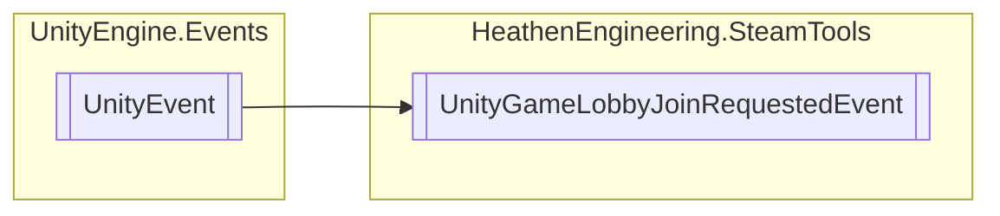

# UnityGameLobbyJoinRequestedEvent `Public class`

## Diagram


## Details
### Inheritance
 - `UnityEvent`&lt;`GameLobbyJoinRequested_t`&gt;

### Constructors
#### UnityGameLobbyJoinRequestedEvent
```csharp
public UnityGameLobbyJoinRequestedEvent()
```

*Generated with* [*ModularDoc*](https://github.com/hailstorm75/ModularDoc)
