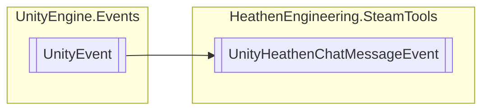

# UnityHeathenChatMessageEvent `Public class`

## Diagram


## Details
### Inheritance
 - `UnityEvent`&lt;[`HeathenChatMessage`](./heathenengineeringsteamtools-HeathenChatMessage)&gt;

### Constructors
#### UnityHeathenChatMessageEvent
```csharp
public UnityHeathenChatMessageEvent()
```

*Generated with* [*ModularDoc*](https://github.com/hailstorm75/ModularDoc)
