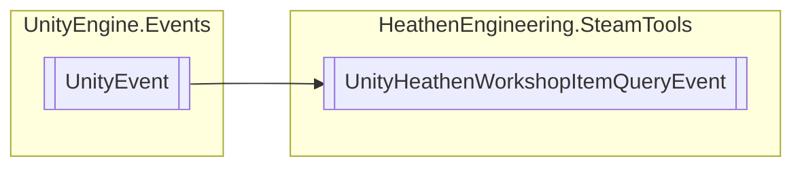

# UnityHeathenWorkshopItemQueryEvent `Public class`

## Diagram


## Details
### Inheritance
 - `UnityEvent`&lt;[`HeathenWorkshopItemQuery`](./heathenengineeringsteamtools-HeathenWorkshopItemQuery)&gt;

### Constructors
#### UnityHeathenWorkshopItemQueryEvent
```csharp
public UnityHeathenWorkshopItemQueryEvent()
```

*Generated with* [*ModularDoc*](https://github.com/hailstorm75/ModularDoc)
