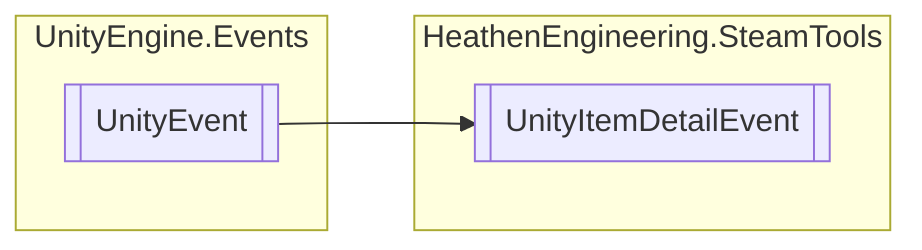

# UnityItemDetailEvent `Public class`

## Diagram


## Details
### Inheritance
 - `UnityEvent`&lt;`bool`, `SteamItemDetails_t``[]`&gt;

### Constructors
#### UnityItemDetailEvent
```csharp
public UnityItemDetailEvent()
```

*Generated with* [*ModularDoc*](https://github.com/hailstorm75/ModularDoc)
