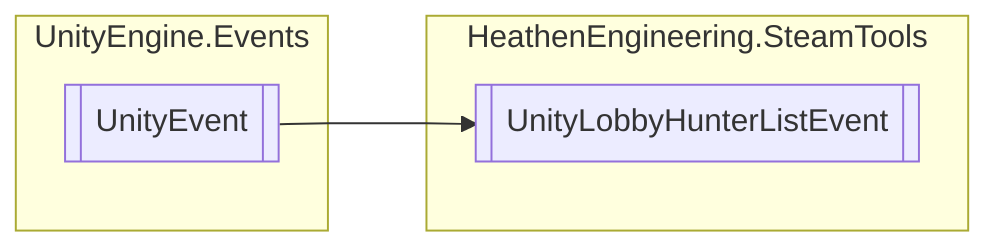

# UnityLobbyHunterListEvent `Public class`

## Diagram


## Details
### Inheritance
 - `UnityEvent`&lt;[`SteamLobbyLobbyList`](./heathenengineeringsteamtools-SteamLobbyLobbyList)&gt;

### Constructors
#### UnityLobbyHunterListEvent
```csharp
public UnityLobbyHunterListEvent()
```

*Generated with* [*ModularDoc*](https://github.com/hailstorm75/ModularDoc)
