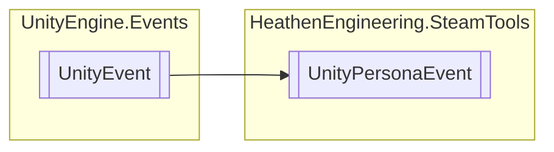

# UnityPersonaEvent `Public class`

## Diagram


## Details
### Inheritance
 - `UnityEvent`&lt;[`SteamUserData`](./heathenengineeringsteamtools-SteamUserData)&gt;

### Constructors
#### UnityPersonaEvent
```csharp
public UnityPersonaEvent()
```

*Generated with* [*ModularDoc*](https://github.com/hailstorm75/ModularDoc)
