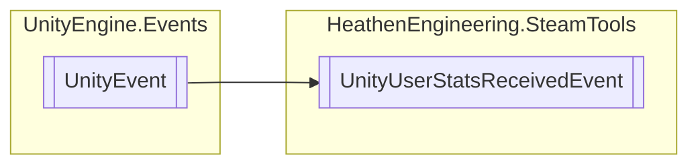

# UnityUserStatsReceivedEvent `Public class`

## Diagram


## Details
### Inheritance
 - `UnityEvent`&lt;`UserStatsReceived_t`&gt;

### Constructors
#### UnityUserStatsReceivedEvent
```csharp
public UnityUserStatsReceivedEvent()
```

*Generated with* [*ModularDoc*](https://github.com/hailstorm75/ModularDoc)
