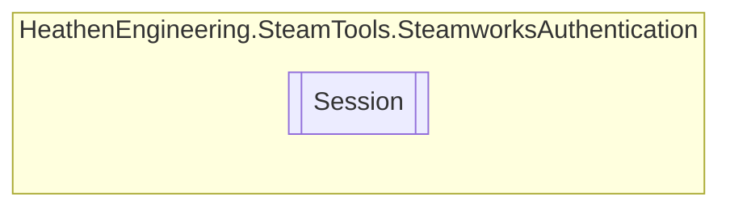

# Session `Public class`

## Diagram


## Members
### Properties
#### Public  properties
| Type | Name | Methods |
| --- | --- | --- |
| `bool` | [`IsBarrowed`](#isbarrowed) | `get` |

### Methods
#### Public  methods
| Returns | Name |
| --- | --- |
| `void` | [`End`](#end)() |

## Details
### Constructors
#### Session
```csharp
public Session()
```

### Methods
#### End
```csharp
public void End()
```

### Properties
#### IsBarrowed
```csharp
public bool IsBarrowed { get; }
```

*Generated with* [*ModularDoc*](https://github.com/hailstorm75/ModularDoc)
