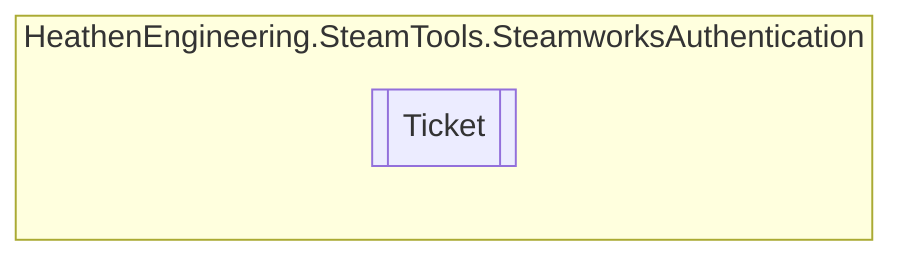

# Ticket `Public class`

## Diagram


## Members
### Properties
#### Public  properties
| Type | Name | Methods |
| --- | --- | --- |
| `TimeSpan` | [`Age`](#age) | `get` |

### Methods
#### Public  methods
| Returns | Name |
| --- | --- |
| `void` | [`Cancel`](#cancel)() |

## Details
### Constructors
#### Ticket
```csharp
public Ticket()
```

### Methods
#### Cancel
```csharp
public void Cancel()
```

### Properties
#### Age
```csharp
public TimeSpan Age { get; }
```

*Generated with* [*ModularDoc*](https://github.com/hailstorm75/ModularDoc)
