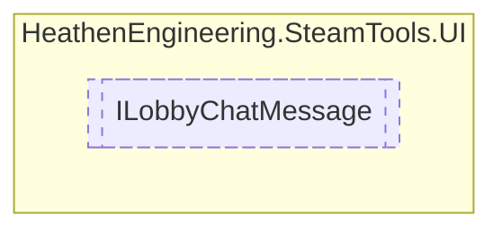

# ILobbyChatMessage `Public interface`

## Diagram


## Members
### Methods
#### Public  methods
| Returns | Name |
| --- | --- |
| `void` | [`RegisterChatMessage`](#registerchatmessage)([`LobbyChatMessageData`](./heathenengineeringsteamtools-LobbyChatMessageData) data) |
| `void` | [`SetMessageText`](#setmessagetext)(`string` sender, `string` message) |

## Details
### Methods
#### RegisterChatMessage
```csharp
public void RegisterChatMessage(LobbyChatMessageData data)
```
##### Arguments
| Type | Name | Description |
| --- | --- | --- |
| [`LobbyChatMessageData`](./heathenengineeringsteamtools-LobbyChatMessageData) | data |   |

#### SetMessageText
```csharp
public void SetMessageText(string sender, string message)
```
##### Arguments
| Type | Name | Description |
| --- | --- | --- |
| `string` | sender |   |
| `string` | message |   |

*Generated with* [*ModularDoc*](https://github.com/hailstorm75/ModularDoc)
