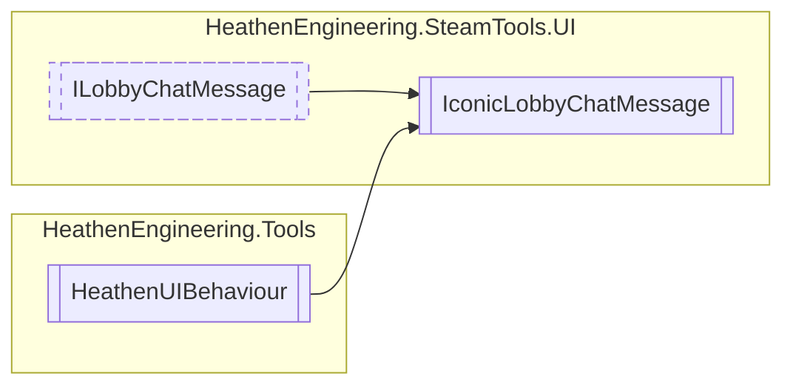

# IconicLobbyChatMessage `Public class`

## Diagram


## Members
### Methods
#### Public  methods
| Returns | Name |
| --- | --- |
| `void` | [`OnPointerEnter`](#onpointerenter)(`PointerEventData` eventData) |
| `void` | [`OnPointerExit`](#onpointerexit)(`PointerEventData` eventData) |
| `void` | [`RegisterChatMessage`](#registerchatmessage)([`LobbyChatMessageData`](./heathenengineeringsteamtools-LobbyChatMessageData) data) |
| `void` | [`SetMessageText`](#setmessagetext)(`string` sender, `string` message) |

## Details
### Inheritance
 - [
`ILobbyChatMessage`
](./heathenengineeringsteamtoolsui-ILobbyChatMessage)
 - `HeathenUIBehaviour`

### Constructors
#### IconicLobbyChatMessage
```csharp
public IconicLobbyChatMessage()
```

### Methods
#### OnPointerEnter
```csharp
public void OnPointerEnter(PointerEventData eventData)
```
##### Arguments
| Type | Name | Description |
| --- | --- | --- |
| `PointerEventData` | eventData |   |

#### OnPointerExit
```csharp
public void OnPointerExit(PointerEventData eventData)
```
##### Arguments
| Type | Name | Description |
| --- | --- | --- |
| `PointerEventData` | eventData |   |

#### RegisterChatMessage
```csharp
public virtual void RegisterChatMessage(LobbyChatMessageData data)
```
##### Arguments
| Type | Name | Description |
| --- | --- | --- |
| [`LobbyChatMessageData`](./heathenengineeringsteamtools-LobbyChatMessageData) | data |   |

#### SetMessageText
```csharp
public virtual void SetMessageText(string sender, string message)
```
##### Arguments
| Type | Name | Description |
| --- | --- | --- |
| `string` | sender |   |
| `string` | message |   |

*Generated with* [*ModularDoc*](https://github.com/hailstorm75/ModularDoc)
