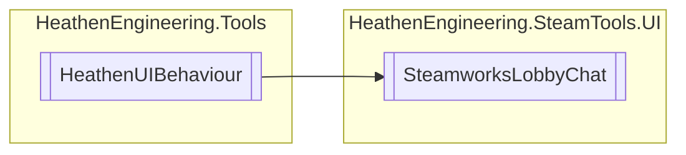

# SteamworksLobbyChat `Public class`

## Diagram


## Members
### Methods
#### Public  methods
| Returns | Name |
| --- | --- |
| `void` | [`ClearMessages`](#clearmessages)() |
| `void` | [`SendChatMessage`](#sendchatmessage-12)(`...`) |
| `void` | [`SendSystemMessage`](#sendsystemmessage)(`string` sender, `string` message) |

## Details
### Inheritance
 - `HeathenUIBehaviour`

### Constructors
#### SteamworksLobbyChat
```csharp
public SteamworksLobbyChat()
```

### Methods
#### ClearMessages
```csharp
public void ClearMessages()
```

#### SendChatMessage [1/2]
```csharp
public void SendChatMessage(string message)
```
##### Arguments
| Type | Name | Description |
| --- | --- | --- |
| `string` | message |   |

#### SendChatMessage [2/2]
```csharp
public void SendChatMessage()
```

#### SendSystemMessage
```csharp
public void SendSystemMessage(string sender, string message)
```
##### Arguments
| Type | Name | Description |
| --- | --- | --- |
| `string` | sender |   |
| `string` | message |   |

*Generated with* [*ModularDoc*](https://github.com/hailstorm75/ModularDoc)
