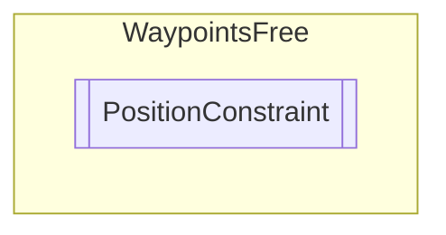

# PositionConstraint `Public enum`

## Diagram

```mermaid
  flowchart LR
  classDef interfaceStyle stroke-dasharray: 5 5;
  classDef abstractStyle stroke-width:4px
  subgraph WaypointsFree
  WaypointsFree.PositionConstraint[[PositionConstraint]]
  end
```

## Details
### Fields
#### XYZ

#### XY

#### XZ

*Generated with* [*ModularDoc*](https://github.com/hailstorm75/ModularDoc)
