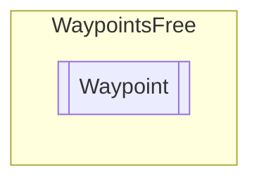

# Waypoint `Public class`

## Diagram


## Members
### Properties
#### Public  properties
| Type | Name | Methods |
| --- | --- | --- |
| `Vector3` | [`XY`](#xy) | `get` |
| `Vector3` | [`XYZ`](#xyz) | `get` |
| `Vector3` | [`XZ`](#xz) | `get` |

### Methods
#### Public  methods
| Returns | Name |
| --- | --- |
| `void` | [`CopyOther`](#copyother)([`Waypoint`](waypointsfree-Waypoint) other) |
| `Vector3` | [`GetPosition`](#getposition)([`PositionConstraint`](./waypointsfree-PositionConstraint) constraint) |
| `void` | [`SetWaypointGroup`](#setwaypointgroup)([`WaypointsGroup`](./waypointsfree-WaypointsGroup) wpg) |
| `void` | [`UpdatePosition`](#updateposition)(`Vector3` newPos, [`PositionConstraint`](./waypointsfree-PositionConstraint) constraint) |

## Details
### Constructors
#### Waypoint
```csharp
public Waypoint()
```

### Methods
#### SetWaypointGroup
```csharp
public void SetWaypointGroup(WaypointsGroup wpg)
```
##### Arguments
| Type | Name | Description |
| --- | --- | --- |
| [`WaypointsGroup`](./waypointsfree-WaypointsGroup) | wpg |   |

#### CopyOther
```csharp
public void CopyOther(Waypoint other)
```
##### Arguments
| Type | Name | Description |
| --- | --- | --- |
| [`Waypoint`](waypointsfree-Waypoint) | other |   |

#### GetPosition
```csharp
public Vector3 GetPosition(PositionConstraint constraint)
```
##### Arguments
| Type | Name | Description |
| --- | --- | --- |
| [`PositionConstraint`](./waypointsfree-PositionConstraint) | constraint |   |

#### UpdatePosition
```csharp
public void UpdatePosition(Vector3 newPos, PositionConstraint constraint)
```
##### Arguments
| Type | Name | Description |
| --- | --- | --- |
| `Vector3` | newPos |   |
| [`PositionConstraint`](./waypointsfree-PositionConstraint) | constraint |   |

### Properties
#### XY
```csharp
public Vector3 XY { get; }
```

#### XYZ
```csharp
public Vector3 XYZ { get; }
```

#### XZ
```csharp
public Vector3 XZ { get; }
```

*Generated with* [*ModularDoc*](https://github.com/hailstorm75/ModularDoc)
