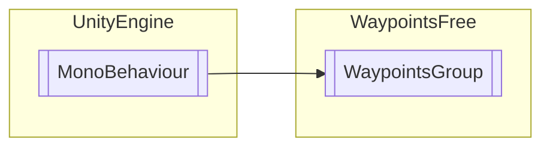

# WaypointsGroup `Public class`

## Diagram


## Members
### Methods
#### Public  methods
| Returns | Name |
| --- | --- |
| `void` | [`AddWaypoint`](#addwaypoint)([`Waypoint`](./waypointsfree-Waypoint) wp, `int` ndx) |
| `List`&lt;[`Waypoint`](./waypointsfree-Waypoint)&gt; | [`GetWaypointChildren`](#getwaypointchildren)(`bool` reparent) |

## Details
### Inheritance
 - `MonoBehaviour`

### Constructors
#### WaypointsGroup
```csharp
public WaypointsGroup()
```

### Methods
#### GetWaypointChildren
```csharp
public List<Waypoint> GetWaypointChildren(bool reparent)
```
##### Arguments
| Type | Name | Description |
| --- | --- | --- |
| `bool` | reparent |   |

#### AddWaypoint
```csharp
public void AddWaypoint(Waypoint wp, int ndx)
```
##### Arguments
| Type | Name | Description |
| --- | --- | --- |
| [`Waypoint`](./waypointsfree-Waypoint) | wp |   |
| `int` | ndx |   |

*Generated with* [*ModularDoc*](https://github.com/hailstorm75/ModularDoc)
