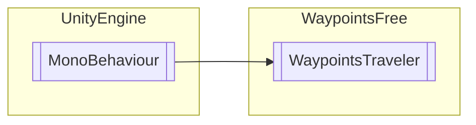

# WaypointsTraveler `Public class`

## Diagram


## Members
### Properties
#### Public  properties
| Type | Name | Methods |
| --- | --- | --- |
| `bool` | [`IsMoving`](#ismoving) | `get` |

### Methods
#### Public  methods
| Returns | Name |
| --- | --- |
| `void` | [`Move`](#move)(`bool` tf) |
| `void` | [`ResetTraveler`](#resettraveler)() |
| `void` | [`SetWaypointsGroup`](#setwaypointsgroup)([`WaypointsGroup`](./waypointsfree-WaypointsGroup) newGroup) |

## Details
### Inheritance
 - `MonoBehaviour`

### Constructors
#### WaypointsTraveler
```csharp
public WaypointsTraveler()
```

### Methods
#### ResetTraveler
```csharp
public void ResetTraveler()
```

#### Move
```csharp
public void Move(bool tf)
```
##### Arguments
| Type | Name | Description |
| --- | --- | --- |
| `bool` | tf |   |

#### SetWaypointsGroup
```csharp
public void SetWaypointsGroup(WaypointsGroup newGroup)
```
##### Arguments
| Type | Name | Description |
| --- | --- | --- |
| [`WaypointsGroup`](./waypointsfree-WaypointsGroup) | newGroup |   |

### Properties
#### IsMoving
```csharp
public bool IsMoving { get; }
```

### Delegates
#### MovementFunction
```csharp
internal delegate bool MovementFunction()
```

*Generated with* [*ModularDoc*](https://github.com/hailstorm75/ModularDoc)
